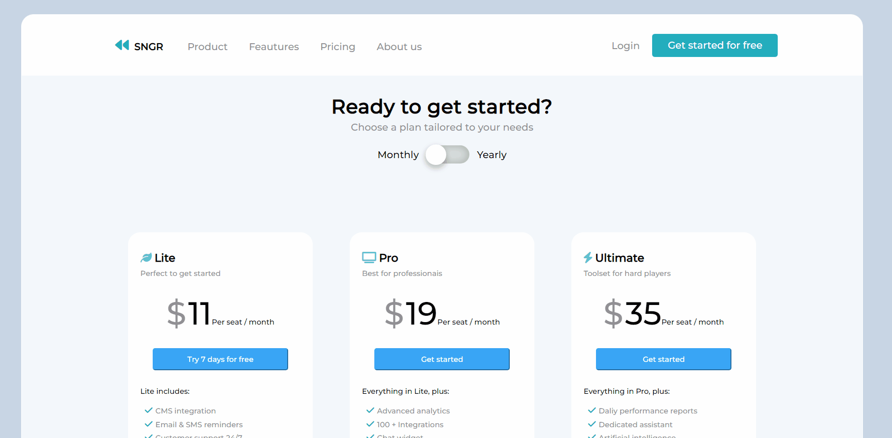

<h1>Pagina de Planos CSS</h1>

 🎓Pagina reecriada para treinar o desenvolvimento de paginas WEB 📟

Conceitos Abordados:

<ul>
  <li>Flexbox</li>
  <li>Responsividade (em desenvolvimento)</li>
  <li>Animações Css</li>
</ul>

 📢 Este Layout foi desenvolvido com base: <i>https://dribbble.com/shots/18236819-SaaS-Pricing-Page/attachments/13440757?mode=media</i>	🗽 

<h4>📛Demonstração:</h4>

